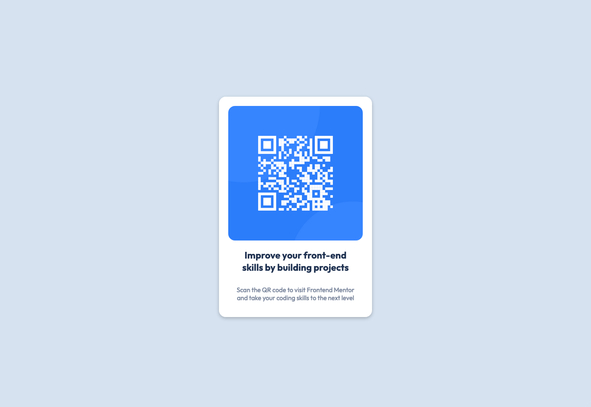

# Frontend Mentor - QR code component solution

This is a solution to the [QR code component challenge on Frontend Mentor](https://www.frontendmentor.io/challenges/qr-code-component-iux_sIO_H). Frontend Mentor challenges help you improve your coding skills by building realistic projects. 

## Table of contents

- [Overview](#overview)
  - [Screenshot](#screenshot)
  - [Links](#links)
- [My process](#my-process)
  - [Built with](#built-with)
- [Author](#author)

## Overview

The challenge was to build out this QR code component and get it looking as close to the design as possible.

### Screenshot

### Links

- Live Site URL: [Add live site URL here](https://radanovicnikola93.github.io/qr-code-component/)

### Built with

- Semantic HTML5 markup
- SCSS for styling
- Flexbox

## Author

- Website - [Nikola Radanović](https://www.nikola-radanovic.com)
- Frontend Mentor - [@radanovicnikola93](https://www.frontendmentor.io/profile/radanovicnikola93)